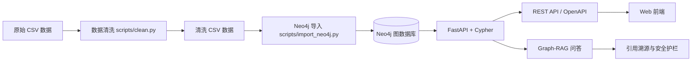

# 医药知识图谱（Medical Knowledge Graph）

基于 **Neo4j + FastAPI + Cypher** 的本地医药知识图谱与临床辅助决策原型。项目将药品、疾病、治疗方案、禁忌症、不良反应、药物相互作用和 ATC 分类等结构化数据构建为图谱，并通过 REST API 与网页界面提供检索、风险检查和可追溯问答能力。

> 医疗安全声明：本项目仅用于学习、演示和技术研究；数据与回答不能替代医生、药师、正式临床指南或急救服务。

## 目录

- [核心能力](#核心能力)
- [系统架构](#系统架构)
- [技术栈](#技术栈)
- [快速开始](#快速开始)
- [API 概览](#api-概览)
- [Graph-RAG、引用与安全策略](#graph-rag引用与安全策略)
- [数据模型与数据流](#数据模型与数据流)
- [项目结构](#项目结构)
- [测试与评估](#测试与评估)
- [已知边界](#已知边界)

## 核心能力

| 模块 | 说明 |
| --- | --- |
| 疾病方案推荐 | 按疾病名称或 ICD 查询治疗方案、药品、证据等级、适用人群和剂量信息。 |
| 药品知识查询 | 返回药品别名、适应症、ATC 分类、不良反应和禁忌信息。 |
| 处方风险检查 | 检测多药联用中的已知相互作用及同类重复用药。 |
| 合并症分析 | 聚合多种疾病对应的治疗方案，并对组合用药执行冲突检查。 |
| 图谱可视化 | 展示疾病、方案、药品及相关知识节点之间的关系。 |
| 图谱问答 | 支持联用检查、禁忌、方案推荐和药品适应症等规则化自然语言问答。 |
| 证据溯源 | 问答结果返回图谱检索元数据和指南来源或本地数据集定位信息。 |
| 安全护栏 | 对紧急风险请求进行拦截；对剂量、停换药等个体化决策要求专业复核。 |

## 系统架构



运行时，业务接口通过参数化 Cypher 查询 Neo4j；问答接口先完成安全判定和意图识别，再检索图谱事实、组织回答并附上引用与免责声明。

## 技术栈

- 图数据库：Neo4j 5
- 后端：FastAPI、Pydantic、Uvicorn
- 图查询：Cypher
- 数据处理：pandas
- 前端：原生 HTML、CSS、JavaScript（vis-network）
- 测试：pytest、FastAPI TestClient
- 配置：python-dotenv、Docker Compose（可选 Neo4j 本地环境）

## 快速开始

### 1. 前置条件

- Python 3.10+
- Neo4j 5，或 Docker Desktop

### 2. 一键启动 Demo（推荐）

启动 Docker Desktop 后执行：

```powershell
powershell -ExecutionPolicy Bypass -File scripts/demo.ps1
```

该脚本会启动 Neo4j、执行清洗和全量导入、启动 API，并在完成健康检查后输出访问地址。

### 3. 手动启动 Neo4j

使用 Docker Compose：

```powershell
docker compose up -d
```

默认 Bolt 地址为 `bolt://127.0.0.1:7687`，默认账号为 `neo4j`，密码为 `password`。也可以使用已有 Neo4j 实例。

Docker Compose 启动时必须在 `.env` 中设置 `NEO4J_PASSWORD`；`password` 仅用于本地脚本默认值，禁止用于生产环境。生产部署请设置 `APP_ENV=production`、`CORS_ALLOWED_ORIGINS` 白名单，并使用 Secret 管理数据库密码。

### 4. 创建 Python 环境并安装依赖

```powershell
python -m venv .venv
.venv\Scripts\Activate.ps1
pip install -r requirements.txt
```

### 5. 配置连接信息

复制 `.env.example` 为 `.env`，再按实际 Neo4j 配置修改：

```env
NEO4J_URI=bolt://127.0.0.1:7687
NEO4J_USER=neo4j
NEO4J_PASSWORD=password
```

### 6. 清洗并导入数据

```powershell
python scripts/clean.py
python scripts/import_neo4j.py --full
```

`--full` 会清空当前 Neo4j 图数据后重新导入；仅需增量导入时请省略该参数。

### 7. 启动服务

```powershell
powershell -ExecutionPolicy Bypass -File scripts/start_web.ps1
```

访问地址：

- Web 界面：<http://127.0.0.1:8000>
- OpenAPI / Swagger：<http://127.0.0.1:8000/docs>
- 健康检查：<http://127.0.0.1:8000/health>

## API 概览

| 接口 | 方法 | 说明 |
| --- | --- | --- |
| `/health` | GET | 验证 API 与 Neo4j 连通性。 |
| `/stats` | GET | 返回图谱节点与关系统计。 |
| `/recommend` | GET | 按 `disease` 或 `icd` 查询治疗方案。 |
| `/drug` | GET | 按 `drug_name` 查询药品详情。 |
| `/interactions` | GET | 以逗号分隔的药品名执行联用检查。 |
| `/interactions/check` | POST | 以 JSON 药品列表执行联用检查。 |
| `/contraindications` | GET | 查询药品与指定情况的禁忌记录。 |
| `/comorbidity` | POST | 聚合多疾病方案并检查药物冲突。 |
| `/graph` | GET | 返回疾病或药品关联子图。 |
| `/path` | GET | 查询两种药品之间的图路径。 |
| `/qa` | POST | 返回带引用与安全决策的图谱问答结果。 |

问答示例：

```powershell
Invoke-RestMethod -Method Post -Uri http://127.0.0.1:8000/qa `
  -ContentType 'application/json' `
  -Body '{"question":"阿司匹林和氯吡格雷能一起用吗？"}'
```

## Graph-RAG、引用与安全策略

`POST /qa` 使用轻量的 Graph-RAG 实现：规则识别问题类型后，使用 Cypher 检索 Neo4j 的结构化事实，再基于检索结果组织回答。它不依赖外部模型服务，因此可在离线本地环境运行。

回答统一包含以下字段：

- `answer`：基于检索事实组织的文本回答；
- `data`：原始结构化检索结果；
- `retrieval`：检索策略、是否有可追溯证据和上下文记录数；
- `citations`：来源标题、图谱字段或 CSV 定位信息、受支撑事实与来源类型；
- `safety`：安全动作、风险等级、触发词、提示和免责声明。

安全策略采用保守处理：

- 出现胸痛、呼吸困难、昏迷、严重过敏、药物过量等紧急风险信号时，系统返回 `blocked`，不访问图谱也不提供在线处置建议；
- 出现剂量、加减量、停换药、处方、妊娠/哺乳、儿童或肝肾功能不全等内容时，系统返回 `review_required`，所有检索结果均需医生或药师复核；
- 方案推荐和药物适应症优先使用图谱中的指南来源字段；相互作用和禁忌的当前演示数据会明确定位到本地 CSV，而非声称外部临床证据验证。

详细契约和引用边界见 [docs/GRAPH_RAG.md](docs/GRAPH_RAG.md)。

### 认证、审计与来源审核

启用认证与审计时，在 `.env` 中设置 `AUTH_ENABLED=true`、至少 32 位的 `AUTH_SECRET`、演示账号和角色（`admin`、`data_steward`、`clinical_reviewer`），并设置 `AUDIT_ENABLED=true`。通过 `POST /auth/token` 获取 Bearer Token；管理员可读取 `/audit/recent`，来源审核通过 `GET /sources`、`GET /sources/{source_id}/reviews` 和 `POST /sources/{source_id}/reviews` 完成。审计日志不记录问题正文、密码或 Token。

也可以使用 CLI 记录审核决定：

```powershell
python scripts/review_sources.py --source-id SRC-001 --review-type metadata `
  --reviewer-id reviewer-001 --reviewer-role data_steward --outcome approved `
  --evidence-url https://example.com/verified-source --notes "核验公开版本"
```

临床内容审核必须使用 `clinical_reviewer` 角色；元数据审核必须使用 `data_steward` 角色。审核记录写入 `data/source_reviews.csv`，最新状态同步回 `data/source_registry.csv`。

审核记录支持证据链接与证据摘录，接口支持审核历史分页；审计日志默认限制为 10 MB，超过后自动轮转为 `.1` 文件。可通过 `AUDIT_MAX_BYTES` 调整阈值，并通过 `/audit/recent?limit=50&offset=0` 分页读取脱敏事件。

企业级运行参数还包括：`RATE_LIMIT_ENABLED`、`RATE_LIMIT_REQUESTS`、`RATE_LIMIT_WINDOW_SECONDS`、`LOG_JSON`。可用 `python scripts/data_quality.py` 生成原始 CSV 数据质量报告；该命令只读数据，不会覆盖清洗结果。

如果本地同时存在其他 Git 远端，建议将项目主分支上游明确设置为本仓库：`git branch --set-upstream-to=medical/main main`，避免误将提交推送到无关仓库。

### 当前版本状态

当前版本已覆盖知识图谱查询、Graph-RAG 引用、安全护栏、用户认证、来源审核、审计日志、请求可观测性、限流和数据质量检查。质量门禁结果为 `24 passed, 1 skipped`；其中跳过项为需要预置 Neo4j 实例的本地 E2E 测试，CI 会在 Neo4j 服务容器中执行该测试。

## 数据模型与数据流

### 核心实体

`Disease`、`Drug`、`Plan`、`Alias`、`Condition`、`AdverseEffect` 与 `AtcClass`。

### 主要关系

`TREATS`、`TARGETS`、`INCLUDES`、`INTERACTS_WITH`、`CONTRAINDICATED_FOR`、`CAUSES`、`HAS_DOSAGE_FOR`、`HAS_ALIAS`、`BELONGS_TO_ATC` 与 `SUBCLASS_OF`。

### 数据处理原则

- `data/raw/` 保存输入数据；`data/clean/` 保存可导入的清洗结果；
- `data/source_registry.csv` 记录来源 ID、发布方、版本、链接、获取日期与审核状态；清洗时会拒绝未登记的指南来源；
- 清洗脚本去重、规范文本、校验关键外键并剔除无效关系；
- 图导入脚本使用 `MERGE` 保证节点与关系幂等；
- 图谱模式与查询定义分别位于 `cypher/schema.cypher` 和 `api/cypher.py`。

来源状态区分“元数据已核验”和“演示待核验”；只有前者确认了公开发布记录，二者都不等同于逐条临床内容审查。详见 [来源治理说明](docs/SOURCE_GOVERNANCE.md)。

## 项目结构

```text
Medical_Knowledge_Graph/
├── api/                   # FastAPI、Cypher 调用、图谱组装、Graph-RAG 与安全策略
├── cypher/                # Neo4j schema 与查询定义
├── data/
│   ├── raw/               # 原始 CSV
│   ├── clean/             # 清洗后的 CSV
│   ├── source_registry.csv # 来源登记与审核状态
│   └── source_reviews.csv  # 审核决定历史
├── config/                # 版本化安全策略
├── data/audit/             # 审计日志（默认不写入 Git）
├── api/auth.py             # Bearer Token 与角色
├── api/audit.py            # 隐私最小化审计
├── config/                # 版本化安全策略
├── docs/                  # 本体、Graph-RAG 与补充技术文档
├── scripts/               # 清洗、导入、启动和评估脚本
├── tests/                 # API、RAG 与安全策略测试
├── web/                   # 原生前端资源
├── docker-compose.yml     # Neo4j 本地容器配置
├── requirements.txt
└── README.md
```

## 测试与评估

运行测试：

```powershell
python -m pytest -q
```

真实 Neo4j 端到端测试由 CI 自动运行；本地需要先完成图谱导入后执行：

```powershell
$env:E2E_NEO4J = "1"
python -m pytest tests/test_e2e_neo4j.py -q
```

运行演示级评估：

```powershell
python scripts/eval.py
```

## 已知边界

- 数据规模和覆盖范围为演示级，不是生产级医学知识库；
- 问答以规则识别与图谱检索为主，尚未实现多轮会话、向量检索或外部 LLM 生成；
- 真实医疗使用还需要权威数据授权、知识版本治理、审计、权限控制、隐私合规和临床验证；
- 不应基于本项目的回答直接进行诊断、处方或紧急处置。

## 相关文档

- [知识图谱本体说明](docs/ONTOLOGY.md)
- [Graph-RAG、引用与安全护栏](docs/GRAPH_RAG.md)
- [完整业务案例](docs/CASE_STUDY.md)
- [3 分钟演示脚本](docs/DEMO_SCRIPT.md)
- [产品与工程演进路线](docs/ROADMAP.md)

本地质量门禁：`powershell -ExecutionPolicy Bypass -File scripts/quality_check.ps1`（未安装 Docker 时追加 `-SkipDocker`）。

### 来源治理与审计界面

启动 API 后进入首页工作台的“来源治理”页，可查看来源目录、元数据/临床内容审核状态，并提交审核结论。启用 `AUTH_ENABLED=true` 后，使用 `/auth/token` 获取管理员令牌，将令牌粘贴到页面的管理员令牌输入框，即可提交审核并查看脱敏审计事件。审核结果会同步写入来源登记表和审核历史 CSV；审计记录默认只保留白名单字段，不记录密码、令牌或临床请求正文。

## License

仅供学习与作品展示使用。
